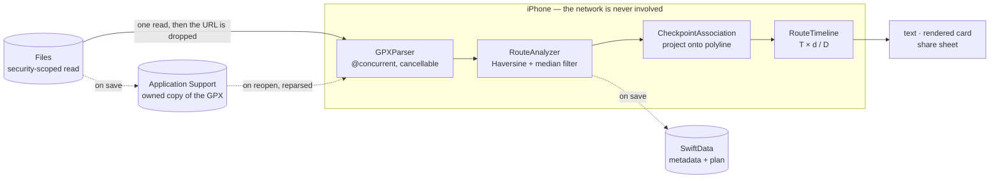

# Rutein — turn every route into a plan

[](https://github.com/ayungavis/rutein/actions/workflows/ios.yml)
[](https://github.com/ayungavis/rutein/actions/workflows/testflight.yml)


A trail runner gets a GPX file the week before a race and still needs three tools to make sense of
it: one for the distance, one for the elevation, a spreadsheet for the timing. **Rutein needs one
file and one number.** Import the route, type your target finish time, and it gives you the pace you
have to hold and the time you should reach every checkpoint.

A **SwiftUI iOS app with no backend at all** — no accounts, no network layer, and it never asks for
your location. Built solo for an Apple Developer Academy challenge in September 2026.

**[Try it on TestFlight](https://testflight.apple.com/join/HgkBEZk6)** — iOS 26 or later.

## Demo

<table>
  <tr>
    <td width="25%"></td>
    <td width="25%"></td>
    <td width="25%"></td>
    <td width="25%"></td>
  </tr>
  <tr>
    <td align="center"><sub>Every route you saved</sub></td>
    <td align="center"><sub>Distance, climb, key climb</sub></td>
    <td align="center"><sub>One number to plan from</sub></td>
    <td align="center"><sub>Checkpoint by checkpoint</sub></td>
  </tr>
</table>

## What it does

1. **Import a GPX.** Tracks and routes, GPX 1.1 and 1.0, default and prefixed namespaces. A file
   holding several usable tracks opens a picker rather than stitching them into one route with a
   teleport in the middle. Parsing is cancellable and capped at 20 MiB, 100,000 points and 1,000
   waypoints — checked while reading, because rejecting a 100,001-point file after building the
   array defeats the limit.
2. **Read the route's real numbers.** Distance by Haversine at a fixed Earth radius. Ascent through
   a three-sample median filter with a 3 m reversal threshold, so GPS noise doesn't inflate the
   climb. Coverage is reported as complete, partial or unavailable — a route with gaps says so
   instead of quietly averaging them away.
3. **Inspect the climb.** A draggable elevation profile reading distance, elevation and grade over a
   100 m window, with the sustained key climb named by range, gain and average grade. The line
   breaks at segment gaps rather than drawing terrain the file doesn't contain.
4. **Plan from one number.** Type a target elapsed time between 1 minute and 48 hours. Average pace
   and every checkpoint estimate come from `T × d / D`. A start time is optional; without one the
   timeline stays relative offsets.
5. **Get a brief you can send.** Start, the GPX's checkpoints or generated 5 km markers, your drink
   and fuel intervals, Finish. Share it as text or a rendered card — previewed before the share
   sheet opens, and never carrying a coordinate or the GPX itself.

## How it works



The phone is the only system. A route is read once under security-scoped access, and the provider
URL is dropped immediately — the bytes live in memory until you save, at which point the file is
copied into Application Support under a UUID filename and SwiftData keeps only metadata. Geometry is
never serialized: reopening reparses the owned file, which is why the analysis version can change
without migrating anything.

## Five decisions worth defending

Each of these cost something. That's what makes them decisions.

**1. Geometry is never stored — the owned GPX is the source of truth.**
SwiftData keeps distance, ascent, coverage and the plan. Reopening a route reparses its copied file,
so a route's numbers can never disagree with the file that produced them.
*The price:* reopening costs a parse, and the library list would too — so the record carries a
64-point thinned outline purely to draw the row thumbnail offline. That's a rendering cache no
measurement is ever derived from, and it's the one documented exception to the rule.

**2. The parser returns candidates, not a route.**
"Never concatenate unrelated tracks" can't be expressed by a type that has already concatenated
them. `GPXParser` returns every track and route it found; the picker chooses one; the choice is
stored so a reopen reparses the *same* one.
*The price:* an extra screen in the import flow, a schema version to store the choice, and the
fingerprint used for duplicate detection has to cover the file **and** the selected track — two
tracks in one file are two different routes.

**3. Ambiguous waypoints get no estimate at all.**
A waypoint sitting on a section the track covers twice has two plausible positions at different
route distances. Rather than pick one, it's flagged and left out of timing.
*The price:* the first real file this met was an out-and-back up Mount Agung, and the rule dropped
6 of its 7 waypoints — a three-row timeline where the map clearly shows more. A guessed checkpoint
time on a route you've never run is worse than an absent one, but the trade-off is real and the
threshold that changes it is written down rather than hand-waved.

**4. Light mode only, because the design file has no dark column.**
Deriving a dark palette would have meant inventing values, then shipping colours nobody designed.
The app is locked to light, and the release check is that it *stays* light with the device in dark
mode.
*The price:* an obvious gap on a 2026 iOS app, and it's listed as one below rather than hidden.

**5. Conventions are build failures, not documents.**
Ten checks in `make ios-validate` refuse a literal colour in a feature view, a view without a
`#Preview`, a second `Logger`, a `CLLocationManager`, or a parser that lost `@concurrent`.
*The price:* writing the check costs more than writing the rule, and one of them didn't work at
first — the design-token rule reported zero violations against a file containing six, because
SwiftLint had served a cached result. Every check is now run red before it's trusted, and
`ios-lint` passes `--no-cache`.

## Engineering practice

| | |
| --- | --- |
| **Tests** | **178** across 26 suites (Swift Testing), running in ~0.2s |
| **No simulator** | macOS is a package platform purely so `swift test` runs on the host. Domain logic that needs UIKit to test is in the wrong layer. |
| **Test code vs source** | 2,763 / 5,417 lines |
| **Fixtures** | 14 GPX files: malformed XML, waypoint-only, missing and partial elevation, two segments, two tracks, route-only, prefixed namespace, GPX 1.0, and a real 34 KB Wikiloc export |
| **Independent expectations** | The Mount Agung fixture's 12,437.447 m was worked out in Python before the Swift engine existed, and it's still what the suite asserts |
| **Schema** | 3 `VersionedSchema` versions, 2 migration stages. The V1→V2 test writes a real store to disk and reopens it through the plan |
| **Design tokens** | Colour assets are generated from the Figma variables export; a colour that drifts from the design file fails the build |
| **CI** | `ios.yml` validates every push; `main` auto-deploys to TestFlight |
| **Lint** | `swiftlint --strict --no-cache`, zero tolerance, six custom rules |

**Every guard is run red before it is trusted.** A check written against already-correct code proves
only that it compiles, so each one is broken on purpose and watched to fail for the expected reason.
That habit caught a real one: the architecture claims `@concurrent` is what keeps GPX parsing off the
main actor, and the test comparing it against a plain `nonisolated async` function showed both
leaving the main actor. SE-0461's caller-actor behaviour needs `NonisolatedNonsendingByDefault`,
which was never enabled — so for most of the build, that annotation was decorative.

## What's shipped, and what isn't

| Shipped | Not yet |
| --- | --- |
| GPX 1.1 and 1.0 import, multi-track picker, cancellable bounded parsing | Dark mode — the app is locked to light |
| Distance, ascent/descent, coverage, key sustained climb | Basemap tile failure detection (SwiftUI's `Map` exposes no signal) |
| Draggable elevation profile with a 100 m grade window | Multiple plans per route |
| Route map with fit-to-route, correct across the antimeridian | Checkpoint editing |
| Target-time planner, optional start time with an IANA zone | Terrain-aware timing |
| Drink and fuel intervals | Offline basemap tiles |
| Checkpoint timeline, distance-marker fallback, ambiguity flagging | Measured performance figures — none are claimed |
| Share as text or a rendered card, previewed first | |
| SwiftData persistence, rename, delete, duplicate detection | |
| English and Bahasa Indonesia throughout | |
| VoiceOver: adjustable chart value, combined timeline rows | |

<details>
<summary><h2>Running it locally</h2></summary>

### Prerequisites

Xcode 26.6 (iOS 26 SDK), then `brew install xcodegen swiftlint swiftformat`

No Docker, no services, no environment file — there is no backend.

### Repository layout

```
.
├── apps/ios/RuteinApp/
│   ├── project.yaml                     XcodeGen spec — source of truth for the Xcode project
│   ├── RuteinApp/                       App target: @main entry, assets, icon, xcconfigs
│   └── RuteinKit/                       Local Swift package — all real code lives here
│       └── Sources/RuteinKit/
│           ├── App/                     AppContainer (composition root), RootView
│           ├── Core/                    AppError, Loadable, Log
│           │   ├── Domains/             value types, all Sendable
│           │   ├── Repositories/        protocol, SwiftData impl, 3 schema versions
│           │   ├── Services/            owned-file store
│           │   └── Utilities/           parser, Haversine, elevation, checkpoints, formatting
│           ├── DesignSystem/            AppColor, AppFont, Spacing, Radius, generated assets
│           └── Features/                RouteLibrary · RouteDetail · RoutePlanner · RouteBrief
├── tools/generate-tokens.py             Generates and verifies the design tokens
└── Makefile                             Every dev command, namespaced ios-*
```

### Build it

```bash
git clone https://github.com/ayungavis/rutein && cd rutein

make ios-generate                        # the .xcodeproj is gitignored — never committed
open apps/ios/RuteinApp/RuteinApp.xcodeproj
```

Or without Xcode, on the booted simulator: `make ios-run`

**Signing:** the simulator needs none. A physical device needs your team in `project.yaml`.

⚠️ Never edit the `.xcodeproj` directly — XcodeGen overwrites it; `project.yaml` is the only source
of truth.

### Try it with a real route

A public Wikiloc export of Mount Agung via Pura Pengubengan is committed as a test fixture:

```
apps/ios/RuteinApp/RuteinKit/Tests/RuteinKitTests/Fixtures/wikiloc-mt-agung.gpx
```

Drag it onto the booted simulator to put it in Files, then import it. It reads **12.4 km** and
**+1,872 m**.

### Commands

| Command | What it does |
| --- | --- |
| `make` | List every target with its description |
| `make ios-generate` | Regenerate `RuteinApp.xcodeproj` (run after clone / editing `project.yaml`) |
| `make ios-format` | SwiftFormat the whole repo |
| `make ios-lint` | SwiftLint strict, plus the preview, location, concurrency and token checks |
| `make ios-test` | Unit tests via `swift test` — no simulator needed |
| `make ios-build` | Build for iPhone simulator (full log: `/tmp/rutein-build.log`) |
| `make ios-run` | Build + install + launch on the booted simulator |
| `make ios-tokens` | Regenerate colour assets from the Figma variables export |
| `make ios-archive` | Local Release archive — the escape hatch when CI is red |
| `make ios-validate` | format → lint → test → build. **Must pass before every push.** |

### The checks that fail the build

| Check | Fails on |
| --- | --- |
| `unauthorized_comment` | any comment outside five allowed prefixes |
| `literal_design_token` | a literal colour, font, spacing, radius or shadow in a feature view |
| `no_parallel_logging` | a second `Logger`, `os_log`, `print` or `NSLog` outside `Core/Log.swift` |
| `localized_text_needs_bundle` | a `Text("…")` resolving against the wrong bundle |
| `no_any_view` · `no_untyped_dictionary` | `AnyView`, or `[String: Any]` in a domain API |
| `make ios-previews` | a `*View.swift` with no `#Preview` |
| `make ios-location-check` | `MapUserLocationButton`, `CLLocationManager`, an authorization request, an `NSLocation*` plist key |
| `make ios-concurrency-check` | `GPXParser.parse` or `RouteAnalyzer.analyse` losing `@concurrent` |
| `make ios-tokens-check` | a hand-edited colour asset, or one no design token generates |

### Troubleshooting

| Symptom | Fix |
| --- | --- |
| Xcode: "Signing for RuteinApp requires a development team" | Set `DEVELOPMENT_TEAM` in `project.yaml`, then `make ios-generate` |
| Simulator: "Requires a newer version of iOS" | Update the runtime (Xcode ▸ Settings ▸ Components) or lower `deploymentTarget` in `project.yaml` |
| `make ios-build` fails with no obvious error | Full log is at `/tmp/rutein-build.log` |
| Project won't open / files missing in Xcode | Re-run `make ios-generate` — the `.xcodeproj` is generated and gitignored |
| Picker shows GPX files greyed out | `UTImportedTypeDeclarations` missing — re-run `make ios-generate` |
| `make ios-tokens-check` fails after editing a colour | Colour assets are generated. Edit the Figma export, then `make ios-tokens` |

</details>

## Third-party

**Cormorant Garamond** is bundled as the display font, under the
[SIL Open Font License 1.1](apps/ios/RuteinApp/RuteinKit/Sources/RuteinKit/DesignSystem/Resources/Fonts/OFL.txt)
— © 2015 the Cormorant Project Authors.

The Mount Agung test fixture is a public Wikiloc export, committed as a route with a public source
rather than a recording of anyone's actual movement.
